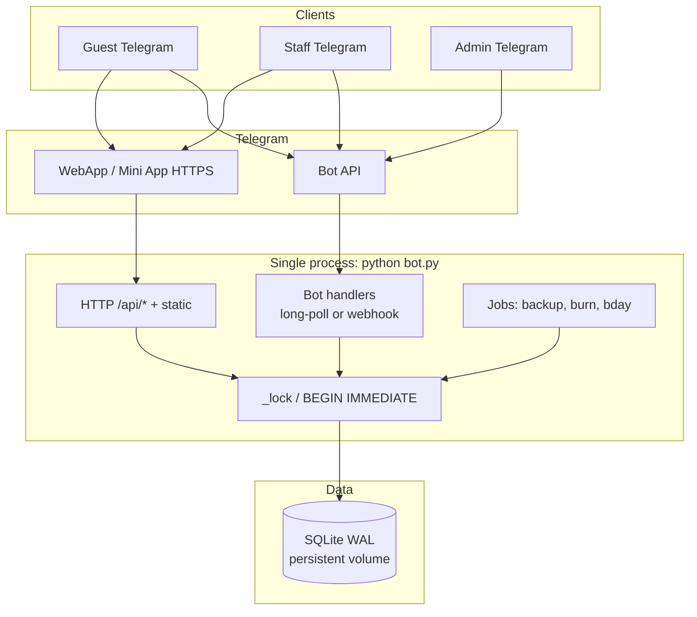
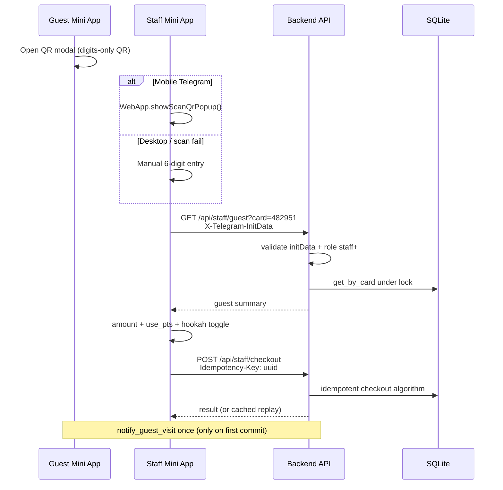
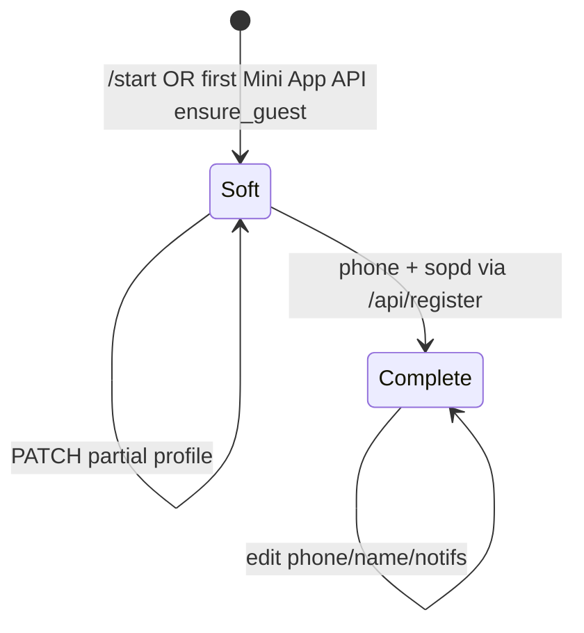
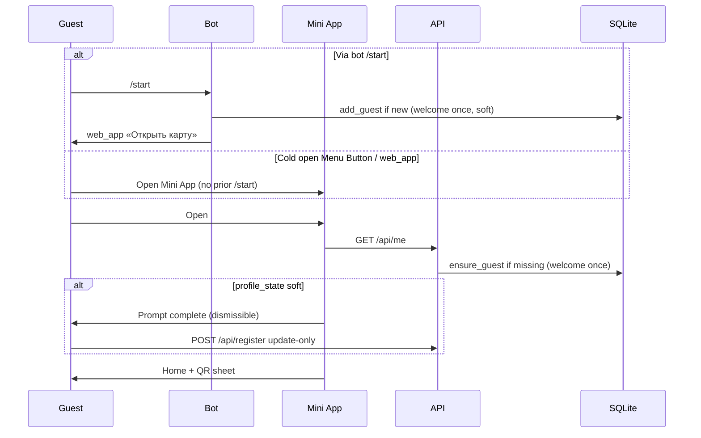
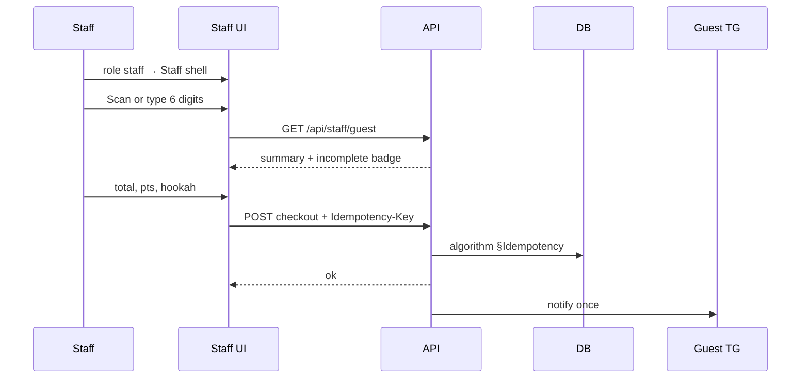
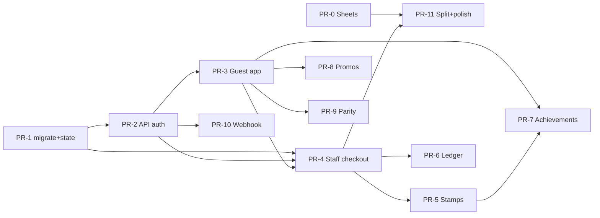

# Исповедь v2 — дизайн-документ продукта лояльности

| Поле | Значение |
|------|----------|
| **Документ** | `DESIGN-Ispoved-v2` |
| **Автор** | AI-integrator (Vlad) + Grok Build |
| **Дата** | 2026-08-11 |
| **Ревизия** | r3 (re-review issues 21–25) |
| **Статус** | Draft |
| **Клиент** | Лаундж-бар «Исповедь», Пермь, ул. Н. Островского, 93Д |
| **Текущий бот** | [@Ispovedloalbot](https://t.me/Ispovedloalbot) |
| **Репозиторий** | `C:\Users\d456p\ispoved-bot` (https://github.com/Vaggo01/ispoved-bot) |
| **Конкурент** | All Stars Lounge (`@AllStarsLoungeBot`) — Telegram Mini App |
| **Цель** | **Переплюнуть** UX/систему All Stars, сохранив сильные стороны Исповеди |

---

## Overview

Текущая система «Исповедь» — монолитный Telegram-бот (`bot.py`, ~3266 строк, stdlib only, SQLite, long-polling). Карта лояльности, кэшбэк с уровнями (Гость/Свой/Резидент), меню, бронь, сообщения директору, панели staff/admin, купоны, CSV-выгрузка и backup `.db` в личку админам. QR-код **технически валидный (payload = 6 цифр карты), но операционно не используется**: staff-сканера в продукте нет, официант набирает номер вручную. Mini App не подключён (`WEBAPP_URL=""`, папки `app/` нет). Google Sheets очередь есть, но интеграция ненадёжна (`SHEETS_URL` hardcoded default, silent drop после 8 retries).

All Stars Lounge — **полноценное Mini App** с тёмной темой, золотыми акцентами, bottom tab bar (Карта | Акции | Профиль), stamp-картой (7 звёзд + подарок на 8-й), крупным QR-modal, достижениями (25), промо-лентой с медиа и polished-анимациями.

**Предложение v2:** сделать **Telegram Mini App** основным UX гостя (и staff), визуально и по smooth-motion **не хуже All Stars**, а по бизнес-логике — **сильнее**: гибрид **кэшбэк+уровни** (дифференциатор) + **stamp «каждый N-й кальян»** (простая ментальная модель), рабочие QR-скан → checkout в 2 тапа, надёжная БД с миграциями и ledger, модульная архитектура при простом деплое. Бот остаётся control-plane (роли, админка, рассылки, deep-links), Mini App — presentation-plane.

**Доставка честная (r3):** «часовой» slice = **shell-demo 4–8 ч**; **рабочий competitive MVP = 2–4 дня** (миграции + API + guest shell + staff checkout с **атомарным** idempotency). Полный продукт (achievements, promos, ledger UI, polish) — следующие PR.

---

## Background & Motivation

### Текущее состояние (as-is)

| Подсистема | Реализация сегодня | Файлы / символы |
|------------|--------------------|-----------------|
| Монолит | Один файл, 0 deps | `bot.py` |
| БД | SQLite WAL, `DB_PATH` | `init()`, таблицы `guests`, `visits`, `coupons`, `coupon_uses`, `sheet_queue`, `settings`, `roles` |
| Лояльность | Кэшбэк 5/7/10% по `spent`, max 30% чека бонусами, welcome 300, 2-й визит 500, ДР 1000, burn 180 дн. | `LOYALTY`, `checkout()`, `preview()`, `level_of()` |
| Карта | 6 цифр, random, без «красивых» номеров | `_next_card()` |
| QR | Custom PNG (Reed-Solomon, no Pillow), payload = `str(card)` | `png()`, `send_card_qr()` ~L1795–1816 |
| Guest UX | Inline-кнопки: QR, карта, бонусы, меню, история, купон, бронь, DM, профиль | `guest_menu()`, `guest_cb()` |
| Staff UX | Текст `карта сумма [бонусы]` → preview → confirm | `staff_text()`, `staff_cb()` `s:ok:gid:total:pts` ~L2253 |
| Admin | stats, guests, coupons, broadcast, export CSV, backup/restore, roles (owner only) | `admin_*` |
| STATE | In-memory `STATE = {}` — **теряется при рестарте** | `set_state` / `get_state` ~L1742 |
| Sheets | `sheet_queue` + `sheets_worker` POST; tries>8 → drop; **default URL не пустой** | `SHEETS_URL` ~L209, `queue_sheet()`, `sheets_worker()` ~L3127 |
| Backup | Daily Telegram document + restore via `.db` upload | `make_copy()`, `worker()`, `restore()` |
| Mini App | Заглушка | `WEBAPP_URL` env, кнопка web_app если не пусто ~L1830 |
| HTTP | **Нет** — только long-poll `getUpdates` | `main()` ~L3185+ |
| `update()` allowlist | `name,phone,bday,note,blocked,muted,username` | ~L833 |

### Pain points (явные)

1. **Хрупкость данных** на ephemeral-хостинге; backup-as-Telegram-doc — last resort, не primary storage strategy.
2. **Google Sheets** — hardcoded URL, silent drop после 8 retries, **Apps Script не в репо**.
3. **QR end-to-end не замкнут** — QR валидный, но **нет staff-сканера**; официант вручную набирает номер.
4. **Нет Mini App** — UX выглядит «чат-ботом 2019», проигрывает All Stars на первом экране.
5. **Монолит** — сложность правок, риск регрессий.
6. **STATE in-memory** — checkout mid-flow / бронь / рассылка ломаются при restart.
7. **Нет premium motion / visual identity** сопоставимой с All Stars.

### Почему «переплюнуть All Stars»

All Stars силён **оболочкой** (Mini App + stamps + achievements + promos). Слабее (по публичному UX) в **бизнес-дифференциации**: stamp alone = «бесплатный N-й», без уровней/кэшбэка/меню/брони/direct-to-director. У Исповеди уже есть **глубина**: cashback levels, full menu, booking, DM, staff/admin ops. Задача — **добавить оболочку уровня All Stars**, не выкидывая глубину.

---

## Goals & Non-Goals

### Goals

1. Guest primary UX = **Telegram Mini App** (dark + gold, bottom tabs: Карта | Акции | Профиль).
2. **Smooth animations** (spec ниже; MVP subset vs Full tagged).
3. **Working QR loop**: large guest QR modal + staff scan → card → amount → confirm (≤2 taps after scan).
4. **Hybrid loyalty**: cashback+levels **+** configurable stamp program (default: каждый 8-й кальян); launch rules fixed in KD-13/14.
5. Achievements (~10–12 **earnable** at launch, schema for 25+), themed «Исповедь».
6. Promotions feed с изображениями.
7. Registration: phone (`requestContact`), name, optional gender, birthday; **state machine soft|complete** (см. §6).
8. Profile + granular notification toggles.
9. Reliable DB: migrations, **bonus ledger**, STATE→DB, integrity, automated backup.
10. Google Sheets: **deprecate live sync** → CSV export + optional outbound webhook; **default `SHEETS_URL=""`**.
11. Keep: menu, booking, DM director, admin, coupons, roles.
12. Modular code, simple deploy; **entrypoint `python bot.py` остаётся навсегда** для MVP+.
13. Security: no PII in QR, roles, rate limits, **fully specified** idempotent checkout.
14. Dual delivery: **Hours Demo (4–8h shell)** + **Working MVP (2–4 days)** + full product PRs — см. Rollout.

### Non-Goals (v2.0)

- Multi-venue chain (одна точка; schema-ready `venue_id` optional later).
- Native iOS/Android apps.
- Full POS / R-Keeper / iiko integration (future; leave webhook hook).
- Real-time multi-device concurrent edit of same checkout (single-staff ok).
- React Native / heavy SPA framework (unless justified later).
- Pixel-perfect clone of All Stars copy/achievements (brand own identity).
- Crypto / NFT / external wallet loyalty.
- Ломать `python bot.py` как единственную команду запуска.

---

## Key Decisions

| # | Решение | Рационале |
|---|---------|-----------|
| **KD-1** | **Primary surface = Telegram Mini App**; bot = roles, admin, notifications, deep-links, fallback | All Stars выигрывает оболочкой; chat-only UX не конкурентоспособен |
| **KD-2** | **Frontend full product: Vite + vanilla TypeScript + pure CSS**. **Hours Demo: prebuilt static** (может быть без Vite на хосте). Build **offline**; ship `app/dist/` artifact | Хост часто без Node; Telegram требует HTTPS static |
| **KD-3** | **Гибридная лояльность**: primary = cashback+levels; secondary = stamp «каждый N-й кальян» | Cashback = differentiator; stamps = mental model All Stars |
| **KD-4** | QR payload **только 6 цифр карты** (digits-only). **Без** URL/`ispoved://` в Hours Demo / Working MVP. Parser: extract `\d{6}` | Совместимо с `png(str(g["card"]))` ~L1803; один формат — меньше багов |
| **KD-5** | Staff: **одна Mini App**, mode по `role` из `/api/me`; `showScanQrPopup` на mobile; desktop = **только manual entry**. Deep-link payload regex **`^c_?(\d{6})$`** (принимает `c482951` и `c_482951`) | 2-tap на телефоне; fallback везде |
| **KD-6** | **SQLite остаётся** + migrations + ledger + dialog_state; `DB_PATH` на **persistent volume** | Нет ops-budget на Postgres; WAL+backup уже есть |
| **KD-7** | **Google Sheets live-sync: deprecate**. Default `SHEETS_URL=""` (сменить hardcoded). Primary = CSV + daily TG backup. Optional webhook | Silent drop / out-of-repo Apps Script = risk |
| **KD-8** | **One process**: long-poll **or** webhook + HTTP for static+API; all DB writes через **shared `_lock` / `BEGIN IMMEDIATE`** | Сохранить deploy simplicity; concurrency explicit |
| **KD-9** | Auth Mini App: **Telegram WebApp `initData` HMAC** (полный алгоритм §Auth); identity **только** из validated `user.id` | Official TG security; fail closed outside Telegram |
| **KD-10** | Checkout **idempotent**: client UUID `Idempotency-Key`; single store `idempotency_keys`; algorithm §Idempotency. Bot path: derived key or debounce | Double-tap risk on `s:ok` today |
| **KD-11** | Achievements rule-based; launch set **only earnable** with current data | Avoid dead achievements (`menu_explorer` deferred) |
| **KD-12** | Delivery honesty: **Hours Demo 4–8h** ≠ Working MVP 2–4d ≠ Full product | Client expectations |
| **KD-13** | **Stamp count mode:** +1 stamp **только** если staff выставил `hookah=true` на checkout (не из `items` — сегодня `items=""`). Cycle = 7 filled → reward, reset | Реалистично без POS |
| **KD-14** | **Free hookah redeem:** `free_hookah_pending` flag; staff `redeem_hookah=true` на checkout **или** `POST /api/staff/redeem-hookah`. Redeem visit: total может быть 0 / partial; **cashback не начисляется на free line** (earned only on `to_pay` money as today). Flag cleared once | Ясный ops UX |
| **KD-15** | **Deps on host:** zero Python deps for Working MVP (stdlib HTTP). Vite только на dev/CI. Optional later: Starlette if host allows pip | Bothost-class |
| **KD-16** | **Card length:** keep **6 digits** | Breaking change not worth All Stars lookalike IDs |
| **KD-17** | **Dual UX** (bot menus + Mini App) minimum **3 months** after Working MVP launch | Soft migration |
| **KD-18** | **Entry forever:** `python bot.py` supported; packages under the hood optional | Bothost habit |
| **KD-19** | **Hosting pattern A (recommended):** Caddy/nginx TLS → static `app/dist` + proxy `/api`. **Pattern B:** static on any HTTPS CDN/host; API must be same-origin **or** CORS+HTTPS API public. Mini App **blocked** without public HTTPS API that validates initData | BotFather Domain requirement |
| **KD-20** | **Webhook vs long-poll:** Working MVP may keep long-poll + ThreadingHTTPServer; Full prefers **webhook on same HTTP server** (unified) when TLS path exists | Simplifies process model later |

---

## Proposed Design

### 1. High-level architecture



### 1.1 Concurrency / process model (explicit)

| Component | Threading | DB access |
|-----------|-----------|-----------|
| Long-poll loop | main thread (or webhook request thread) | all mutations under `_lock` |
| `ThreadingHTTPServer` / stdlib server | worker threads per request | **must** acquire same `_lock` before any write; reads preferably under lock too for consistency |
| `daily_worker`, backup `worker` | daemon threads | same `_lock`; backup uses `make_copy()` (SQLite backup API) |
| `restore()` | admin path | set global `MAINTENANCE=True` → API returns **503** `{code:"maintenance"}`; close conn; swap file; reopen; clear flag |

**Rules:**
- Env: `API_HOST=0.0.0.0`, `API_PORT=8080` (or host-assigned).
- One global `sqlite3` connection with `check_same_thread=False` **or** connection-per-request with `BEGIN IMMEDIATE` for writes — **prefer keep current single-conn + `_lock`** for Working MVP to minimize risk.
- HTTP and bot **never** call `checkout` without lock (extract `checkout` to module that always locks internally — today already `with _lock` at L874).
- Health `GET /api/health` does not take long locks; if maintenance → 503.

### 1.2 Hosting decision (concrete patterns)

Telegram Mini Apps **require HTTPS** and BotFather **Domain**.

#### Pattern A — Recommended (VPS / Caddy)

```
Internet → :443 Caddy (TLS automatic)
              ├─ /        → file_server app/dist
              └─ /api/*   → reverse_proxy 127.0.0.1:8080
Bot process listens 127.0.0.1:8080 (API only) + long-poll OR webhook to /tg/webhook
WEBAPP_URL=https://ispoved.example.com/
```

#### Pattern B — Bothost-constrained

1. Build Mini App **on dev machine / CI** → commit or release artifact **`app/dist/`** (host has **no Node**).
2. If Bothost gives public HTTPS reverse-proxy to the process: serve static+API from process (Pattern A simplified).
3. If host is **bot-only** (no public HTTP): Mini App **cannot** call private API → **Working MVP blocked** until public HTTPS API exists. Hours Demo can still show static shell with mock data on any static HTTPS host (GitHub Pages / CDN) **without** real checkout.
4. Document gate: **PR-API requires “host can expose HTTPS to `/api`”** before staff/guest real data.

#### Build pipeline

```
dev:  cd app && npm i && npm run build  →  app/dist/
deploy: copy app/dist + python sources; no Node on server
```

Env vars: `BOT_TOKEN`, `OWNERS`, `DB_PATH`, `WEBAPP_URL`, `API_HOST`, `API_PORT`, `SHEETS_URL=""` (default empty), `SHEETS_ENABLED=0`, `BACKUP_ENABLED`, `STAMP_ENABLED`.

### 2. Repository structure (target)

```
ispoved-bot/
├── bot.py                 # STABLE entry: python bot.py (forever)
├── src/                   # packages extracted incrementally
│   ├── config.py
│   ├── db/ ...
│   ├── web/ ...
│   ├── tg/ ...
│   ├── qr/generator.py
│   └── jobs/ ...
├── app/                   # Mini App source
│   ├── index.html
│   ├── src/ ...
│   └── dist/              # SHIPPED prebuilt (CI or committed)
├── migrations/
├── tests/                 # unittest (stdlib)
│   └── test_checkout.py
├── docs/DESIGN.md
├── requirements.txt       # empty for Working MVP
└── README.md              # hosting A/B, WEBAPP_URL, BotFather Domain
```

**Incremental extract rule:** intermediate states must still run via `python bot.py`. Full tree above is target end-state (PR-split), not day-1 big-bang.

### 3. Guest Mini App IA

Bottom tab bar:

| Tab | Содержание |
|-----|------------|
| **Карта** | Greeting, hybrid stamp+level card, QR button, tiles, recent transactions |
| **Акции** | Active promos + stamp program detail + archive |
| **Профиль** | Avatar, name, phone, level; settings, history, achievements, notif toggles, feedback, СОПД, booking, DM |

**Staff mode (same origin, no separate bot):**  
`GET /api/me` returns `role`. If `role ∈ {staff, admin, owner}` → render **Staff shell** (Scan / Manual card / Shift stats) instead of guest tabs. Owner/admin can switch «как гость» for testing.

### 4. Hybrid loyalty model

#### 4.1 Cashback + levels (unchanged math)

Как `checkout()` / `LOYALTY` сегодня:

```
levels: Гость 0→5%, Свой 15000→7%, Резидент 50000→10%
max_pay_percent: 30
welcome: 300, second_visit: 500, birthday: 1000, burn_days: 180
spent += to_pay  (money portion, not full total)  # preserve L899
```

#### 4.2 Stamp program (KD-13/14)

```python
STAMP = {
    "enabled": True,
    "title": "Каждый 8-й кальян бесплатно",
    "slots": 7,                 # fill 7 → reward on 8th conceptual slot
    "reward_label": "Бесплатный кальян",
    "count_mode": "staff_toggle",  # ONLY hookah=true on checkout
    "auto_reset": True,
}
```

**Hours Demo:** stamp UI visual only (`stamp_count` may be 0).  
**Working MVP:** increment only via staff `hookah` toggle in checkout API/bot.  
**Do not** depend on `items` string (currently empty in `s:ok`).

**Redeem free hookah:**
- Guest has `free_hookah_pending=1` after full cycle.
- Staff sets `redeem_hookah=true` → clear flag; optional note in visit; does **not** auto-add stamp; cashback only on paid `to_pay`.
- Endpoint: field on `POST /api/staff/checkout` **and** dedicated `POST /api/staff/redeem-hookah` `{card}` for zero-amount redeem.

### 5. QR that works

#### 5.1 Payload freeze (Working MVP)

- **Encode:** `str(card)` six digits only — same as today `png(str(g["card"]))`.
- **Decode (staff scan / manual):** find first match of `\d{6}` in scanned text; ignore surrounding noise if user later pastes URL.
- **Not in MVP:** `ispoved://`, t.me links inside QR (deep-link is separate channel).

#### 5.2 Guest QR UX

Large sheet modal, scale ≥ 10, quiet ≥ 4; pretty `482 951` + copy. Server: `GET /api/qr` returns `{card, pretty, png_base64}` using existing pure-Python `png()` — **no JS QR library** (deps policy). `png_base64` — raw base64 PNG bytes (client may prefix `data:image/png;base64,` if needed); alternatively field may be full `image_data_url` — **canonical name: `png_base64`**.

#### 5.3 Staff scan path



**Deep-link parse (bot `on_message`):**

```python
# /start c482951  or  /start c_482951  → normalize
# payload after /start may be in msg text: parts = text.split(maxsplit=1)
m = re.match(r"^c_?(\d{6})$", payload or "")
if m and role in staff/admin:
    open_staff_checkout_prefill(card=m.group(1))
```

Today `/start` **ignores** payload (~L3063) — must add.

### 6. Registration / profile state machine

| State | Criteria | QR shown? | Welcome bonus |
|-------|----------|-----------|---------------|
| **soft** | row in `guests` for `tg_id`; missing phone **or** missing `sopd_accepted_at` (bday recommended but not blocking QR) | **Yes** (venue speed) | Granted on first `add_guest` / first signup visit only |
| **complete** | phone non-empty **and** `sopd_accepted_at` set; name non-empty; bday optional but prompted | Yes | Never re-granted |

**Rules:**
1. `/start` → soft-register as today (`add_guest`): welcome **once** via existing insert path.
2. **Cold open (no prior `/start`):** Menu Button / direct `web_app` may open Mini App for a user who never messaged the bot. Validated `initData.user.id` exists, but **no** `guests` row. **Normative:** on **any** authenticated guest API route (`GET /api/me`, `/api/qr`, `/api/register`, …), after initData validation: if `get_by_tg(tg_id)` is `None` → call once `add_guest(tg_id, name_from_user, username_from_user)` (same welcome-once path as `/start`), then proceed. Do **not** return 404 for “never started.” 401/404 only for bad initData / blocked / not found card (staff). This is **ensure_guest(tg_id, user)**, not a second welcome path.
3. `POST /api/register` remains **update-only** for existing row (after ensure_guest). **Never** calls `add_guest` itself. **Never** re-grants welcome. Extend `update()` allowlist: `first_name`, `last_name`, `gender`, `sopd_accepted_at`, notif flags.
4. `GET /api/me` returns `profile_state: "soft"|"complete"`, `missing: ["phone","sopd",...]` (always has a guest row after ensure).
5. Mini App: if soft → gate optional full-screen complete form; can dismiss and still open QR (staff sees badge `profile_incomplete` on staff guest card).
6. `requestContact`: WebApp method; if user denies → free-text phone field (parity with current `setphone`).
7. Gender optional; bday once for guest self-serve (admin can change) — same as today.



### 7. Achievements (earnable launch set)

**Launch (~10)** — only rules fireable with current ops data:

| id | Title | Rule type | Earnable now? |
|----|-------|-----------|---------------|
| `first_confession` | Первая исповедь | `event:signup` | Yes |
| `second_breath` | Второе дыхание | `visits_gte:2` | Yes |
| `night_owl` | Ночной приход | `visit_hour_gte:23` | Yes if TZ ok |
| `hookah_initiate` | Дымный дебют | `hookah_stamps_gte:1` | Yes after KD-13 |
| `hookah_cycle` | Чистый лист | `stamp_cycles_gte:1` | Yes |
| `svoi` | Свой человек | `level_gte:Свой` | Yes |
| `resident` | Резидент | `level_gte:Резидент` | Yes |
| `birthday_guest` | Именинник | `flag:got_bday` | Yes |
| `big_check` | Щедрость | `check_gte:5000` | Yes |
| `loyal_10` | Десять визитов | `visits_gte:10` | Yes |
| `voice_heard` | Голос услышан | `event:dm` | Yes |

**Deferred (not launch):** `menu_explorer` — needs non-empty `items`/menu tags at checkout (POS or staff menu picker) — **post-POS**.

**`rule_json` schema:**

```json
{"type": "visits_gte", "n": 10}
{"type": "level_gte", "name": "Свой"}
{"type": "hookah_stamps_gte", "n": 1}
{"type": "stamp_cycles_gte", "n": 1}
{"type": "check_gte", "amount": 5000}
{"type": "visit_hour_gte", "hour": 23}
{"type": "event", "name": "signup|dm|coupon"}
{"type": "flag", "field": "got_bday_year_set"}
```

### 8. Promotions feed

Table `promos(...)`. **Body = plain text** (no raw HTML). Images via `image_url` HTTPS. Mini App: `white-space: pre-wrap`; CSP `default-src 'self'; img-src 'self' https: data:; connect-src 'self'`.

### 9. Staff Mini App / bot

**2 taps after scan:** (1) scan/manual → summary (2) amount → confirm.  
**Bot retained:** `карта сумма [pts]` + confirm.  
**Idempotency on bot:** see §Idempotency (derived key).  
**API down:** staff Mini App banner: «API недоступен — в боте: `номер сумма`».

### 10. Admin

Keep all features. Change settings line: Sheets «не подключена» when `SHEETS_URL=""`. Early PR: default empty + gate `queue_sheet`.

### 11. Menu, booking, DM

Unchanged product behavior; Mini App forms → same admin notify paths.

### 12. Animations specification

Tech: CSS + rAF where needed; `prefers-reduced-motion: reduce`.

| Element | Motion | Duration | **Tier** |
|---------|--------|----------|----------|
| App shell load | Fade + Y | 280ms | Full |
| Tab switch | Cross-fade + 8px | 200ms | **MVP** |
| Stamp slot fill | Scale pop + glow | 350ms stagger | **MVP** |
| Stamp cycle confetti | CSS particles | 800ms | Full |
| Level progress bar | Width | 400ms | **MVP** |
| QR sheet slide-up | Transform + dim | 280ms | **MVP** |
| QR appear | Scale + fade | 220ms | **MVP** |
| Achievement modal spring | Spring CSS | 400ms | Full |
| Checkout checkmark SVG | Stroke draw | 300ms | Full |
| Button press | scale(0.97) | 80ms | **MVP** |
| Empty states | Fade | 200ms | MVP |
| Tile ripple | CSS | 150ms | Full |

### 13. Hosting guidance (ops checklist)

| Concern | Guidance |
|---------|----------|
| DB path | `DB_PATH=/data/ispoved.db` persistent |
| TLS | Pattern A or B — Mini App unusable without HTTPS |
| Build | Offline `app/dist`; no Node on server |
| Process | `python bot.py`; restart policy |
| Backup | Daily TG on; `make_copy` before migrations |
| Secrets | env only |

---

## Idempotency algorithm (KD-10) — normative

**Single source of truth:** table `idempotency_keys`.  
**Do not** rely on partial unique index on `visits` as primary (optional secondary unique for audit only — **omit in Working MVP** to avoid dual-write confusion).

### Table

```sql
CREATE TABLE IF NOT EXISTS idempotency_keys(
  key TEXT PRIMARY KEY,
  staff_tg_id INTEGER NOT NULL,
  request_hash TEXT NOT NULL,   -- sha256 of canonical body (see below)
  response_json TEXT NOT NULL,
  at TEXT NOT NULL
);
```

### Client

- Header: **`Idempotency-Key: <uuid-v4>`** (required on `POST /api/staff/checkout`).
- Body fields used for business logic: `card` **or** `guest_id`, `total`, `use_pts`, `hookah`, `redeem_hookah` (optional `items` ignored for hash in Working MVP).
- Generate **new UUID per user intent** (new confirm tap). Retry same failed network → **same** UUID.

### Canonical request hash (normative)

`request_hash = SHA-256(canonical_json).hexdigest()` where **canonical_json** is built server-side after parse/coerce — **not** from raw request bytes.

1. Parse JSON body. Reject if both `card` and `guest_id` present and resolve to **different** guests → `400 {code:"card_guest_mismatch"}`.
2. Resolve identity: if `guest_id` set → use it; else resolve `card` via `get_by_card` → internal `guest_id` (integer). Missing guest → `404` **before** hash lookup for new keys (replay still keyed by client key).
3. Coerce fields (defaults if omitted):
   - `guest_id`: int  
   - `total`: int  
   - `use_pts`: int, default `0`  
   - `hookah`: bool, default `false`  
   - `redeem_hookah`: bool, default `false`  
4. Build object with **exactly** these keys, **sorted** alphabetically:  
   `{"guest_id": <int>, "hookah": <bool>, "redeem_hookah": <bool>, "total": <int>, "use_pts": <int>}`  
5. Serialize: `json.dumps(obj, ensure_ascii=False, separators=(",", ":"), sort_keys=True)` — **no spaces**; bools → `true`/`false` (JSON); ints without quotes.  
6. UTF-8 encode → SHA-256 → lowercase hex.

Example: `guest_id=1, total=2400, use_pts=0, hookah=true, redeem_hookah=false` →  
`{"guest_id":1,"hookah":true,"redeem_hookah":false,"total":2400,"use_pts":0}`

### Atomic commit vs current `checkout()` (must-fix for PR-4)

**Problem:** today’s `checkout()` (~L873–916) does `with _lock: … conn().commit()` **internally** at L907, then returns; callers run `notify_guest_visit` / `queue_sheet` **outside**. If PR-4 calls that function and only **then** inserts `idempotency_keys`, a crash after visit commit and before key INSERT → retry with same `Idempotency-Key` **double-applies**.

**Normative refactor (required):**

1. Extract core mutator that does **not** commit by itself, e.g. `_checkout_apply(gid, total, use_pts, …)` writing guest/visits/stamps/ledger rows, **or** add `checkout(..., *, commit=True)` with `commit=False` for the HTTP path.
2. **Single critical section** under the same `_lock`:

```
with _lock:
    # 1) SELECT idempotency_keys by key
    #    hit+hash match → return cached (replay=true); no writes
    #    hit+hash mismatch → raise 409
    # 2) validate guest / preview math
    # 3) mutate guests + INSERT visits (+ ledger/stamps when enabled)
    # 4) INSERT idempotency_keys(key, staff_tg_id, request_hash, response_json, at)
    # 5) conn.commit()   # ONE commit for visit+key (+ledger)
# AFTER lock released and only if replay is false:
notify_guest_visit(...)   # Telegram I/O — never inside DB transaction
queue_sheet(...)          # if SHEETS_ENABLED (usually off)
```

3. **Forbidden:** commit visit, release lock, then insert key in a second transaction.
4. **Bot path** uses the same `checkout_idempotent(...)` helper (debounce or derived key still OK as key material) so power-user `s:ok` cannot bypass atomicity.
5. Sheets/export/notify are **not** part of the DB transaction and run **only** when `replay=false`.

### Server algorithm (under `_lock` / single transaction)

```
1. Validate initData → staff_tg_id; role ∈ staff|admin|owner
2. Parse body; coerce; compute request_hash = sha256(canonical_json)  # § above
3. with _lock:
   a. SELECT * FROM idempotency_keys WHERE key=?
      - Row exists AND request_hash matches:
           → return HTTP 200 + stored response_json, replay=true
             (NO notify, NO stamp/ledger writes)
      - Row exists AND request_hash differs:
           → return HTTP 409 {code:"idempotency_mismatch"}
   b. Run business logic once (no inner commit):
        preview → mutate guest → INSERT visits → ledger → stamps
        build response_json (include ok, guest, earned, paid, …)
   c. INSERT idempotency_keys(key, staff_tg_id, request_hash, response_json, at)
   d. COMMIT once
4. If not replay: notify_guest_visit; optional export hooks
5. return 200 + response (replay flag set appropriately)
```

### Bot path `s:ok:gid:total:pts`

Today double-tap can double-apply. Fix: route through **same** atomic helper.

```
derived_key = f"bot:{staff_uid}:{gid}:{total}:{pts}:{minute_bucket}"
# minute_bucket = floor(unix/60)  OR store last confirm in dialog_state debounce 3s
```

Prefer: generate UUID in preview message, embed short token in callback (callback_data 64-byte limit — token in `dialog_state`). **Simplest Working MVP:** server-side debounce — if same staff+gid+total+pts within 5 seconds and last visit matches → return previous result without re-apply (still via idempotency_keys when possible).

### GC

Job: `DELETE FROM idempotency_keys WHERE at < now-48h` daily.

### Side effects on replay

Stamps, ledger, achievements, **notifications**, sheets — **not** re-executed.

---

## Auth: initData validation (normative)

Reference: [Telegram Web Apps — Validating data received via the Mini App](https://core.telegram.org/bots/webapps#validating-data-received-via-the-mini-app).

### Transport

- Header **`X-Telegram-InitData`**: raw `initData` query string from `Telegram.WebApp.initData`.
- Alternative: `Authorization: tma <initData>` (optional; prefer header above).
- **Fail closed:** empty/missing → `401 {code:"unauthorized"}`. Desktop browser without Telegram → no access to real API (Hours Demo static mock only).

### Algorithm

```
1. Parse initData as application/x-www-form-urlencoded → dict
2. Extract hash = fields.pop("hash"); if missing → 401
3. data_check_string = "\n".join(f"{k}={v}" for k,v in sorted(fields.items()))
4. secret_key = HMAC_SHA256(key=b"WebAppData", msg=bot_token.encode())
5. calculated = HMAC_SHA256(key=secret_key, msg=data_check_string.encode()).hex()
6. if not hmac.compare_digest(calculated, hash): → 401 bad_hash
7. auth_date = int(fields["auth_date"])
8. max_age = 3600 for mutating routes (POST); 86400 for GET /api/me optional
   if now - auth_date > max_age: → 401 stale
9. user = json.loads(fields["user"]); tg_id = int(user["id"])
10. NEVER trust body.tg_id / body.role — only this tg_id
11. role = role_of(tg_id); enforce per-route
```

### Fixtures (tests)

| Case | Expected |
|------|----------|
| Valid signature, fresh auth_date | 200 |
| Bad hash | 401 `bad_hash` |
| Stale auth_date | 401 `stale` |
| Missing user | 401 |
| Valid guest calling `/api/staff/*` | 403 `forbidden` |

---

## API / Interface Changes

### Conventions

- `Content-Type: application/json; charset=utf-8`
- Errors: `{"error": "human text", "code": "snake_case"}` — TS client parses JSON on error too.
- CORS: if static origin ≠ API origin, allow only `WEBAPP_URL` origin; prefer **same origin** (Pattern A).
- No API version prefix in MVP (`/api/...`); breaking changes later → `/api/v2`.

### Routes

| Method | Path | Role | Description |
|--------|------|------|-------------|
| GET | `/api/health` | — | `{ok, db, schema_version, maintenance, guests}` |
| GET | `/api/me` | any authed | profile + role + profile_state |
| POST | `/api/register` | guest+ | update-only complete profile |
| PATCH | `/api/me` | guest+ | name/notifs/phone |
| GET | `/api/history?limit=&offset=` | guest | paginated |
| GET | `/api/qr` | guest | card + png base64 |
| GET | `/api/menu` | guest | MENU |
| GET | `/api/promos` | guest | active+archive |
| GET | `/api/achievements` | guest | defs+progress |
| POST | `/api/booking` | guest | |
| POST | `/api/feedback` | guest | DM |
| POST | `/api/coupon` | guest | |
| GET | `/api/staff/guest?card=` | staff+ | lookup |
| POST | `/api/staff/preview` | staff+ | dry-run |
| POST | `/api/staff/checkout` | staff+ | **Idempotency-Key required** |
| POST | `/api/staff/redeem-hookah` | staff+ | clear free flag |

### Example: GET /api/me

```json
{
  "tg_id": 123,
  "role": "guest",
  "profile_state": "soft",
  "missing": ["phone", "sopd"],
  "card": "482951",
  "pretty_card": "482 951",
  "name": "Иван",
  "first_name": "Иван",
  "last_name": "",
  "phone": "",
  "bday": "",
  "bonus": 300,
  "spent": 0,
  "visits": 0,
  "level": {"name": "Гость", "cashback": 5},
  "next_level": {"name": "Свой", "from": 15000, "need": 15000},
  "stamp_count": 0,
  "stamp_slots": 7,
  "free_hookah_pending": 0,
  "notif": {"loyalty": true, "promo": true, "reviews": true}
}
```

### Example: POST /api/staff/preview

Request:

```json
{"card": "482951", "total": 2400, "use_pts": 0, "hookah": true, "redeem_hookah": false}
```

Response (parity with `preview()` ~L856–871 + stamp preview fields):

```json
{
  "ok": true,
  "guest_id": 1,
  "name": "Иван",
  "level": {"name": "Гость", "cashback": 5},
  "max_pay": 300,
  "pay": 0,
  "to_pay": 2400,
  "earned": 120,
  "balance_after": 420,
  "stamp_count_after": 1,
  "free_hookah_pending_after": 0
}
```

### Example: POST /api/staff/checkout

Headers: `Idempotency-Key: 550e8400-e29b-41d4-a716-446655440000`, `X-Telegram-InitData: ...`

Request: same as preview.

Response:

```json
{
  "ok": true,
  "guest": {"card": "482951", "bonus": 420, "visits": 1, "stamp_count": 1},
  "earned": 120,
  "extra": 0,
  "why": "",
  "paid": 0,
  "level": {"name": "Гость", "cashback": 5},
  "replay": false
}
```

Replay: same body + same key → `replay: true`, identical payload, HTTP 200.

Error examples: `404 guest_not_found`, `403 forbidden`, `409 idempotency_mismatch`, `400 invalid_total`, `423 blocked`, `503 maintenance`, `429 rate_limited`.

### QR image

`GET /api/qr` response:

```json
{
  "card": "482951",
  "pretty": "482 951",
  "png_base64": "iVBORw0KGgoAAAANSUhEUgAA..."
}
```

Server builds PNG via pure-Python `png(card)`. Client: ``. No npm `qrcode` dependency.

---

## Data Model Changes

### Baseline keep

`guests`, `visits`, `coupons`, `coupon_uses`, `sheet_queue` (legacy), `settings`, `roles`.

### New / altered

```sql
CREATE TABLE IF NOT EXISTS schema_migrations(
  version INTEGER PRIMARY KEY,
  applied_at TEXT NOT NULL
);

-- guests extensions (each ALTER in migrate with try/ignore duplicate column)
-- first_name, last_name, gender, stamp_count, stamp_cycles,
-- free_hookah_pending, notif_loyalty, notif_promo, notif_reviews, sopd_accepted_at

CREATE TABLE IF NOT EXISTS bonus_ledger(
  id INTEGER PRIMARY KEY AUTOINCREMENT,
  guest_id INTEGER NOT NULL,
  delta INTEGER NOT NULL,
  balance_after INTEGER NOT NULL,
  reason TEXT NOT NULL,
  ref_type TEXT DEFAULT '',
  ref_id INTEGER DEFAULT 0,
  at TEXT NOT NULL,
  by_user TEXT DEFAULT '',
  FOREIGN KEY(guest_id) REFERENCES guests(id) ON DELETE CASCADE
);

CREATE TABLE IF NOT EXISTS idempotency_keys(
  key TEXT PRIMARY KEY,
  staff_tg_id INTEGER NOT NULL,
  request_hash TEXT NOT NULL,
  response_json TEXT NOT NULL,
  at TEXT NOT NULL
);

CREATE TABLE IF NOT EXISTS dialog_state(
  tg_id INTEGER PRIMARY KEY,
  mode TEXT NOT NULL,
  data_json TEXT DEFAULT '{}',
  updated_at TEXT NOT NULL
);

CREATE TABLE IF NOT EXISTS achievement_defs(
  id TEXT PRIMARY KEY,
  title TEXT NOT NULL,
  description TEXT DEFAULT '',
  category TEXT NOT NULL,
  rarity TEXT NOT NULL,
  rule_json TEXT NOT NULL,
  sort INTEGER DEFAULT 0,
  active INTEGER DEFAULT 1
);

CREATE TABLE IF NOT EXISTS guest_achievements(
  guest_id INTEGER NOT NULL,
  achievement_id TEXT NOT NULL,
  progress INTEGER DEFAULT 0,
  target INTEGER DEFAULT 1,
  unlocked_at TEXT,
  PRIMARY KEY(guest_id, achievement_id)
);

CREATE TABLE IF NOT EXISTS promos(
  id INTEGER PRIMARY KEY AUTOINCREMENT,
  title TEXT NOT NULL,
  body TEXT DEFAULT '',
  image_url TEXT DEFAULT '',
  starts_at TEXT DEFAULT '',
  ends_at TEXT DEFAULT '',
  active INTEGER DEFAULT 1,
  sort INTEGER DEFAULT 0,
  created_at TEXT
);

-- visits: optional columns hookah INTEGER DEFAULT 0
-- NO unique on visits.idempotency_key in Working MVP (keys table is SoT)
```

### Display name helper

Keep `guests.name` as **display source** for bot messages. On register: set `name = (first_name + " " + last_name).strip()` and store first/last separately. Avoid drift: all writers go through `set_display_name()`.

### Migration strategy

1. On boot: `make_copy()` → `DB_PATH.before-migrate-{stamp}` **before** applying pending migrations.
2. Apply `migrations/*.sql` in version order; record `schema_migrations`.
3. `ALTER TABLE ADD COLUMN`: catch `duplicate column name` / check `pragma table_info` first (portable).
4. Partial indexes: require SQLite ≥ 3.8.0 (note in README; modern Python wheels OK).
5. Gate every `queue_sheet` call: `if SHEETS_ENABLED and SHEETS_URL: ...` else no-op.
6. Default config: **`SHEETS_URL = os.environ.get("SHEETS_URL", "")`** — remove hardcoded production URL.
7. Backfill first/last from `name` best-effort once; ledger backfill optional offline script.

---

## Alternatives Considered

### A1. Pure stamp program (drop cashback)

Rejected — throws away balances/levels.

### A2. React/Vue SPA

Rejected for v1 — heavier than needed.

### A3. Postgres

Deferred — single venue scale.

### A4. Fix Google Sheets as primary CRM

Rejected as default — CSV + webhook instead.

### A5. External staff QR page outside Telegram

Rejected as primary — Mini App auth is stronger.

### A6. Separate staff bot

Rejected — roles already isolate surfaces.

### A7. Webhook Bot API + unified HTTP server vs long-poll + extra HTTP

- **Webhook+unified:** one server handles TG updates + `/api` + static; cleaner under TLS (Pattern A). Preferred **when HTTPS exists**.
- **Long-poll + ThreadingHTTPServer:** works without public webhook URL; more threads. OK for Working MVP if host has public port for API only.
- **Verdict:** Working MVP allows long-poll; Full product prefers webhook on same server (KD-20).

### A8. Prebuilt static HTML without Vite (true zero-Node demo)

- **Pros:** Hours Demo in hours; no npm on any machine if hand-written CSS/JS.
- **Cons:** Weaker DX for Full product.
- **Verdict:** **Hours Demo may use hand-built or Vite-prebuilt `dist/`**. Full product standardizes on Vite offline build.

### A9. Bot-only QR improvement first (staff scan tiny page, no guest redesign)

- **Pros:** Fastest fix for pain #3.
- **Cons:** Does not beat All Stars guest UX.
- **Verdict:** Acceptable emergency path; product goal still Mini App guest shell. Can ship staff scan in Working MVP alongside guest QR.

### A10. Third-party loyalty SaaS / Telegram Payments

Rejected — cost, data lock-in, loses custom cashback/admin depth.

---

## Security & Privacy Considerations

| Threat | Severity | Mitigation |
|--------|----------|------------|
| QR leaks PII | High | Digits-only card |
| Card enumeration | Medium | Staff-only lookup; rate limit; log repeated 404 |
| Forged API | High | initData HMAC; fail closed; identity from user.id only |
| Priv esc | High | Server `role_of` |
| Double checkout | High | Idempotency algorithm § |
| Backup PII | Medium | Admin-only TG docs |
| 152-FZ | High | `sopd_accepted_at`; legal text open Q |
| Promo XSS | Medium | Plain text body; CSP; no `innerHTML` for promos |
| Broadcast HTML | Medium | Admin-only; existing risk documented |
| SHEETS URL secret in repo | Low | Default `""`; remove hardcoded |

### Rate limiter (implementable)

- In-memory token bucket per `tg_id` (single process OK): e.g. 30 req/min for `/api/staff/guest`, 10 checkout/min.
- On exceed: `429 {code:"rate_limited"}`.
- Lost on restart — acceptable; optional persist later.
- Log `rate_limit_hit` + `staff_lookup_404` counters; if >N 404s/min from one staff → notify admins (enumeration signal).

### Guest data isolation

Every guest route loads guest **only** via `get_by_tg(validated_tg_id)`. Ignore any `guest_id` in body for guest role.

---

## Observability

| Signal | Implementation |
|--------|----------------|
| Logs | `log("checkout_ok", ...)`, `checkout_fail`, `scan_ok`, `api_401`, `api_429`, `idempotency_replay` |
| Health | `/api/health` |
| Maintenance | 503 during restore |
| Staff ops | Mini App: on fetch fail show **«перейдите в бот: карта сумма»** (cross-link bot fallback) |
| Metrics | log lines sufficient for venue scale |
| Audit | visits.by_user, ledger.by_user |

Error codes for staff: `guest_not_found`, `blocked`, `invalid_total`, `idempotency_mismatch`, `maintenance`, `unauthorized`, `forbidden`, `rate_limited`.

---

## Rollout Plan

### Feature flags

| Flag | Default | Meaning |
|------|---------|---------|
| `MINI_APP_ENABLED` | 1 if WEBAPP_URL set | web_app button |
| `STAMP_ENABLED` | 1 | stamp rules |
| `ACHIEVEMENTS_ENABLED` | 0 until content | |
| `PROMOS_ENABLED` | 0 | |
| `SHEETS_ENABLED` | **0** | |
| `API_RATE_LIMIT` | 1 | |

### Delivery tiers (honest — Issue 1 fixed)

| Tier | Time box | Scope | Client message |
|------|----------|-------|----------------|
| **Hours Demo** | **4–8 hours** | Prebuilt static shell (dark/gold, tabs, mock or read-only `/api/me`), decorative/large QR UI, **no** full migrations/registration machine required | «Вот как будет выглядеть» |
| **Working MVP** | **2–4 days** | PR sequence: migrations+state, Sheets gate, HTTP+initData, guest shell+real data+QR API, **staff checkout+idempotency** | «Можно сканировать и начислять» |
| **Full product** | **1–2+ weeks** | Stamps rules polish, ledger UI, achievements, promos, booking/DM in app, webhook unify, animation Full tier, hardening | «Переплюнули All Stars» |

**Drop language:** «same day shippable full PR-1…PR-4» — **false**.  
**Working MVP is the first competitive product**; Hours Demo is sales/UI proof only.

### Hours Demo (4–8h) — explicit cuts

| In | Out |
|----|-----|
| Static `app/dist` shell, brand colors | Full registration/СОПД gate |
| Tabs + QR sheet animation | Real staff scan checkout |
| Mock guest OR read-only me if API already up | Migrations package extract |
| Bot button if WEBAPP_URL points at static | Achievements, promos media, ledger |

### Working MVP (2–4 days) — must include

| In | Out (later) |
|----|--------------|
| migrations + dialog_state + idempotency_keys | Full package split |
| initData auth + API schemas | Achievements |
| Guest Home real bonus/level + QR from `png()` | Promo admin CRUD |
| Staff scan/manual + checkout real `checkout()` + idempotency | Fancy confetti |
| Stamp UI; increment only if toggle wired (may ship toggle in same MVP) | menu_explorer achievement |
| SHEETS default off | Webhook BI |
| `python bot.py` entry + hosting README | |

### Rollback

- `WEBAPP_URL=""` → chat-only; additive DB safe.
- API 503 maintenance on restore.
- Bot text checkout always works.

---

## Open Questions (true unknowns only)

1. **СОПД / legal text** — needs lawyer/client copy before hard gate on `complete`.
2. **Brand assets** — venue photo, exact gold palette, logo files.
3. **Bothost actual HTTPS** — confirm Pattern A vs B with client host (blocks Working MVP if no public API).
4. ~~Stamp mode~~ → **KD-13**
5. ~~Free hookah~~ → **KD-14**
6. ~~Deps~~ → **KD-15**
7. ~~Card length~~ → **KD-16**
8. ~~Dual UX duration~~ → **KD-17**

---

## Risks

| Risk | Sev | Mitigation |
|------|-----|------------|
| Client expects full Mini App «за часы» | High | Hours Demo vs Working MVP wording |
| No HTTPS on host | Critical | Gate Working MVP; Hours Demo static only |
| Double spend | High | Idempotency § |
| Host wipes disk | High | Volume + TG backup + migrate copy |
| initData bugs = open API | High | Fixtures; fail closed |
| Staff rejects scanner | Med | Bot text forever + Mini App fallback banner |
| Scope creep achievements | Med | Earnable-only launch list |
| Concurrency corruption | High | Shared `_lock`; maintenance flag on restore |

---

## Testing strategy

- **Runner:** stdlib `unittest` (no pytest required). `python -m unittest discover -s tests`.
- **PR with checkout extract (Working MVP staff PR):** `tests/test_checkout.py` golden cases:
  - pay capped at 30% and balance
  - earned = to_pay * cashback // 100
  - spent increases by **to_pay** not total
  - second visit extra once
  - birthday once per year
  - blocked guest error
  - idempotent double checkout same key → one visit row, `replay=true` second call
  - idempotency mismatch 409 (same key, different total)
  - **atomicity:** after successful checkout, `idempotency_keys` row exists in same DB state as the new `visits` row (cannot observe visit without key); implement via single-commit API, not multi-phase commit
  - `canonical_json` hash stable across key order / default omission (`use_pts` omitted ≡ 0)
  - cold open: `ensure_guest` creates row once; second `/api/me` does not double welcome
- initData fixtures table (§Auth)
- Manual: iOS/Android Telegram; desktop staff = manual entry; restore drill

---

## Success metrics

| Metric | Target |
|--------|--------|
| Staff checkout after scan | ≤ 10s median |
| Mini App open rate 7d | ≥ 60% active |
| Double-charge | 0 |
| DB loss | 0 |
| Owner polish review | «не хуже All Stars / своя идентичность» |

---

## Guest sequence



---

## Staff sequence



---

## Module map (from monolith)

| Current | Target |
|---------|--------|
| MENU, LOYALTY, BRAND, env | `src/config.py` |
| init, guests, find | `src/db/*` |
| checkout, preview, adjust | `src/db/checkout.py` |
| png | `src/qr/generator.py` |
| call, send, kb | `src/tg/api.py` |
| guest_* / staff_* / admin_* | `src/tg/*.py` |
| STATE | `src/db/state.py` |
| sheets_worker | gated off |
| backup/restore | `src/jobs/backup.py` |
| — | `src/web/*`, `app/*` |

---

## UI visual system (brief)

- BG `#0B0B0C`, gold `#C6A75E`–`#E8D5A3`, text `#F5F2EA` / `#9A958A`
- Cards radius 16–20px; tab bar active gold
- Brand voice: dark lounge «Исповедь»

---

## Google Sheets (explicit)

- **Deprecate live sync.**
- Change default `SHEETS_URL` to `""`.
- `SHEETS_ENABLED=0`.
- Admin copy: only CSV, not «обновляется автоматически».
- Optional nightly webhook later.

---

## PR Plan

**Count: 12 PRs** (PR-0…PR-11). Independently reviewable.  
**Hours Demo:** can be done **without** merging all PRs — static `app/dist` + optional mock.  
**Working MVP:** **PR-0 + PR-1 + PR-2 + PR-3 + PR-4** (≈2–4 days focused).

### PR-0 — Sheets honesty + default empty URL (quick win)

- **Title:** `fix(sheets): default SHEETS_URL empty; gate queue_sheet; admin copy`
- **Files:** `bot.py` config L209, `queue_sheet`, admin settings text, `sheets_worker` start condition
- **Deps:** none
- **Description:** Stop claiming connected table; prevent silent queue growth. No UX regression.

### PR-1 — Migrations runner + dialog_state (no big package move)

- **Title:** `chore(db): schema_migrations + dialog_state; backup before migrate`
- **Files:** `migrations/`, `migrate` helpers in bot or `src/db/migrate.py`, replace `STATE` dict with DB, keep `python bot.py`
- **Deps:** none (parallel to PR-0)
- **Description:** Behavior-preserving. **No** full monolith extract. `make_copy` before migrate.

### PR-2 — HTTP API + initData auth + health

- **Title:** `feat(web): stdlib HTTP server, initData validation, /api/health /api/me`
- **Files:** `src/web/auth.py`, `server.py`, `routes.py`, tests for auth fixtures; README hosting A/B gate
- **Deps:** PR-1 (guest read)
- **Description:** Full auth algorithm. Fail closed. Env `API_HOST`/`API_PORT`. **Blocked on host HTTPS for production WEBAPP_URL.**

### PR-3 — Guest Mini App shell + QR API (real data)

- **Title:** `feat(app): guest Mini App Home/Profile shell + server QR png`
- **Files:** `app/` source + **`app/dist`**, `/api/qr` (`png_base64`), `/api/register` update-only, `ensure_guest` on guest routes, profile_state; bot web_app button
- **Deps:** PR-2
- **Description:** Dark/gold tabs, level progress, stamp **display**, QR sheet (MVP motions). Registration state machine + cold-open soft-create. Ship prebuilt dist.

### PR-4 — Staff checkout + scan + idempotency + unittest

- **Title:** `feat(staff): checkout API, scan/manual UI, idempotency, bot debounce, tests`
- **Files:** extract `checkout` with **`commit=False` / single-commit** path writing `idempotency_keys` in same transaction; `/api/staff/*`; staff shell by role; deep-link `^c_?(\d{6})$`; bot `s:ok` via same helper; `tests/test_checkout.py` (money + atomicity + canonical hash)
- **Deps:** PR-1, PR-2 (PR-3 for shared UI kit strongly recommended same release train)
- **Description:** **Closes QR operational gap.** Shared `_lock`; **one commit** for visit+key; notify only if `replay=false`. Golden money + idempotency tests.

### PR-5 — Stamps rules + free hookah redeem

- **Title:** `feat(loyalty): stamp toggle rules + free_hookah_pending redeem`
- **Files:** stamps module, checkout fields `hookah`/`redeem_hookah`, redeem endpoint
- **Deps:** PR-4
- **Description:** KD-13/14 implementation.

### PR-6 — Bonus ledger + history pagination

- **Title:** `feat(db): bonus_ledger dual-write from checkout/adjust/burn/coupon`
- **Files:** migrations ledger, writers, `/api/history`
- **Deps:** PR-4
- **Description:** Dual-write from day of merge; optional backfill script. Early checkout without ledger only in pre-PR-6 deploys — acceptable.

### PR-7 — Achievements earnable set

- **Title:** `feat(gamification): achievement_defs + evaluator + UI`
- **Files:** defs seed (earnable only), evaluator post-checkout, UI Full motion optional
- **Deps:** PR-3, PR-4, PR-5 (for hookah rules)
- **Description:** No `menu_explorer` at launch.

### PR-8 — Promotions feed + admin create

- **Title:** `feat(promos): plain-text promos + images + admin bot flow`
- **Files:** promos table, API, Акции tab, CSP notes
- **Deps:** PR-2, PR-3
- **Description:** No HTML bodies.

### PR-9 — Menu, booking, DM, granular notifs in Mini App

- **Title:** `feat(app): menu/booking/DM/notif toggles parity`
- **Files:** app screens, API, guest_text parity paths
- **Deps:** PR-3
- **Description:** Bot features inside Mini App.

### PR-10 — Webhook optional unify + hosting polish

- **Title:** `feat(ops): optional webhook mode; maintenance flag; ops README`
- **Files:** webhook route, MAINTENANCE, staff API-down banner already in PR-4 verify
- **Deps:** PR-2
- **Description:** KD-20 path when TLS ready.

### PR-11 — Incremental package extract + Full animations + exit criteria

- **Title:** `refactor: continue module split; Full-tier motion; exit criteria`
- **Files:** `src/tg/*` as needed; animation Full tags; README
- **Deps:** Working MVP merged
- **Exit criteria:** (1) `python bot.py` works (2) no behavior change checklist green (3) app/dist builds offline (4) unittest pass (5) staff scan+checkout demo recorded  
- **Description:** Not infinite refactor — stop when exit criteria met.

### Dependency graph



**Working MVP train:** PR-0 ∥ PR-1 → PR-2 → PR-3 ∥ start PR-4 → merge PR-4 (guest QR + staff loop together for credibility).

---

*Конец дизайн-документа «Исповедь v2» r3 (issues 21–25: atomic idempotency, cold-open guest, canonical hash, deep-link regex, png_base64).*
